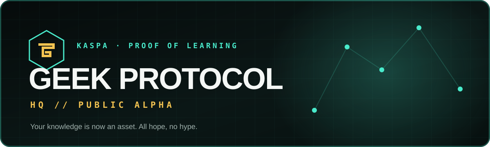
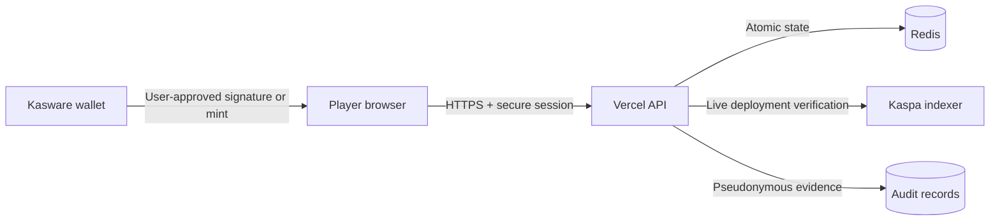

<div align="center">
  

  <br />

  [](https://github.com/GEEKProtocol0110/geek-protocol-hq/actions/workflows/security-verification.yml)
  [](https://www.geekprotocol.xyz/)
  [](LICENSE)
  [](docs/PROJECT-STATUS.md)

  **A server-authoritative learning and competition platform built for the Kaspa ecosystem.**

  [Live HQ](https://www.geekprotocol.xyz/) · [Play](https://www.geekprotocol.xyz/play/) · [Explore the Grid](https://www.geekprotocol.xyz/collection/) · [Security](https://www.geekprotocol.xyz/security/) · [Documentation](docs/README.md)
</div>

---

## What is Geek Protocol?

Geek Protocol turns knowledge into a verifiable player journey. Players compete in timed trivia, build persistent profiles, join live lobbies, contribute reviewed questions, and interact with the GEEK ecosystem through a non-custodial Kasware flow.

The project began as a way to make learning exciting for one child. HQ is the public Alpha where that idea is becoming a transparent, security-first Proof-of-Learning platform on Kaspa.

> **All hope, no hype.** Public claims in this repository distinguish what is live, internally verified, independently audited, and still gated.

## Current status

| System | Status | Boundary |
| --- | --- | --- |
| Public website and information surfaces | **Live** | Production at `www.geekprotocol.xyz` |
| Ranked trivia, lobbies, leaderboards, and profiles | **Public Alpha** | Server-authoritative; Redis required |
| Kasware identity and account recovery | **Implemented** | Server-verified Kaspa Schnorr ownership proof |
| GEEK fair-mint interface | **Live / non-custodial** | One user-approved request against the pinned deployment |
| Community Content Engine | **Alpha** | Reviewed questions earn internal first-use credits |
| Alpha GEEK rewards | **Internal ledger only** | No withdrawals, transfers, or promised monetary value |
| 500-Geek collection | **Design and provenance phase** | Ownership and collection minting are disabled |
| Independent security audit | **Not completed** | Required before treasury-controlled value movement |

See the dated [Project Status](docs/PROJECT-STATUS.md) for the release-readiness matrix and open launch gates.

## Product surfaces

| Surface | Purpose |
| --- | --- |
| **Play** | Ten-round Geek Gauntlet plus server-owned Daily and Speed modes |
| **Lobbies** | Active seats, shareable rooms, and host-started ten-question shared practice rounds with server-scored standings |
| **Profile** | Verified XP, levels, prestige, category mastery, journey history, and collectibles |
| **C.C.E.** | Community question submission, moderation, publication, and first-use reward records |
| **Collection** | Deterministic 500-Geek identity blueprint and hashed legacy-art archive |
| **Mint** | Fail-closed, user-approved GEEK KRC-20 fair-mint interface |
| **Security** | Public control posture, trust boundaries, and independent-audit gates |

## Architecture at a glance



The browser renders the experience but does not own ranked answers, scores, rewards, moderation results, or payout eligibility. Sensitive state transitions are verified and committed by the server. Read the full [Architecture and Trust Boundaries](docs/ARCHITECTURE.md).

## Security posture

Geek Protocol is designed to fail closed around identity, mint verification, ranked play, and any future value movement.

- Ranked answer keys never enter the public bundle.
- Scores, XP, streaks, rewards, and deadlines are computed by the server.
- Shared lobby rounds use a fixed server clock and one atomic answer per player and question; their practice standings do not award Alpha GEEK or tokens.
- Wallet challenges are random, single-use, short-lived, and bound to the exact HTTPS origin and action.
- The server verifies Kaspa Schnorr signatures and public-key/address correspondence.
- Mint requests are pinned to Kaspa Mainnet and the canonical GEEK deployment.
- An unavailable indexer, deployment mismatch, or exhausted supply blocks mint initiation.
- Payout preferences cannot activate settlement; withdrawals remain disabled.
- Security events are private, pseudonymous, and integrity verifiable.
- Every production change runs tests, deterministic manifest checks, and security-control verification.

This repository has **not** completed an independent audit. Read [SECURITY.md](SECURITY.md), the [Threat Model](docs/THREAT-MODEL.md), and the [Independent Audit Scope](docs/AUDIT-SCOPE.md) before making security claims or proposing value-moving code.

## Repository map

```text
api/          Vercel Function entry points
server/       Domain logic, identity, ranking, rewards, and controls
public/       Production pages, client assets, and public manifests
tests/        Integration, mint, collection, and archive tests
scripts/      Deterministic generators and security verification
security/     Machine-readable control and evidence map
docs/         Protocol, architecture, audit, and product documentation
.github/      CI, issue forms, and pull-request standards
```

## Local development

### Requirements

- Node.js 20 or newer
- npm
- An Upstash Redis database for persistent sessions and ranked features

### Setup

```sh
git clone https://github.com/GEEKProtocol0110/geek-protocol-hq.git
cd geek-protocol-hq
npm ci --ignore-scripts
cp .env.example .env.local
npm run verify
```

Vercel serves `public/` and discovers serverless functions in `api/`. Static information pages work without Redis; stateful and ranked surfaces fail closed when their required storage is unavailable.

### Required production configuration

| Variable | Purpose |
| --- | --- |
| `UPSTASH_REDIS_REST_URL` | Redis REST endpoint |
| `UPSTASH_REDIS_REST_TOKEN` | Redis REST credential |
| `CCE_ADMIN_TOKEN` | Dedicated question-moderation credential |
| `AUDIT_LOG_SECRET` | HMAC-SHA-256 audit-integrity key |
| `AUDIT_KEY_ID` | Non-secret audit key identifier |
| `AUDIT_ADMIN_TOKEN` | Private audit-export credential |
| `PAYOUT_REVIEW_ADMIN_TOKEN` | Separate payout-review credential |

The annotated [.env.example](.env.example) documents optional settings and safe local placeholders. Never commit production credentials.

## Verification

Run the same complete quality gate used for reviewed changes:

```sh
npm run verify
```

The command validates functional tests, the deterministic 500-Geek manifest, all recovered-art hashes, security invariants, and control evidence. CI also checks JavaScript syntax and audits production dependencies at `high` severity.

## Documentation

Start with the [Documentation Index](docs/README.md). Key reviewer material includes:

- [Architecture and Trust Boundaries](docs/ARCHITECTURE.md)
- [Project Status](docs/PROJECT-STATUS.md)
- [Independent Audit Scope](docs/AUDIT-SCOPE.md)
- [Threat Model](docs/THREAT-MODEL.md)
- [Identity Protocol](docs/IDENTITY-PROTOCOL.md)
- [Mint Protocol](docs/MINT-PROTOCOL.md)
- [Payout Risk Controls](docs/PAYOUT-RISK-CONTROLS.md)
- [Collectible Protocol](docs/COLLECTIBLE-PROTOCOL.md)
- [500-Geek Art Bible](docs/GEEK-500-ART-BIBLE.md)

## Contributing

Read [CONTRIBUTING.md](CONTRIBUTING.md) before opening a pull request. Every change must preserve the project's public Alpha boundaries, pass `npm run verify`, and avoid claims that exceed the available evidence.

Do not report unpatched vulnerabilities in a public issue. Follow [SECURITY.md](SECURITY.md) and use GitHub private vulnerability reporting.

## License

Code in this repository is available under the [MIT License](LICENSE). Geek Protocol names, logos, character artwork, lore, and other brand assets are not granted for reuse by that software license unless separately stated.

---

<div align="center">
  <strong>Level Up. Earn On. Geek Out.™</strong><br />
  Built on Kaspa · Your knowledge is now an asset.
</div>
