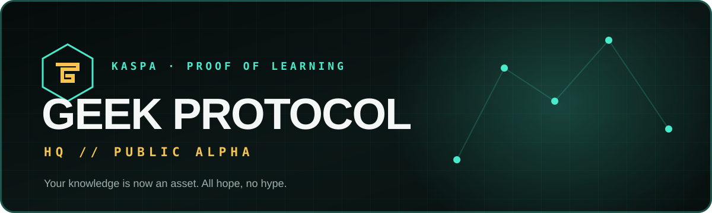
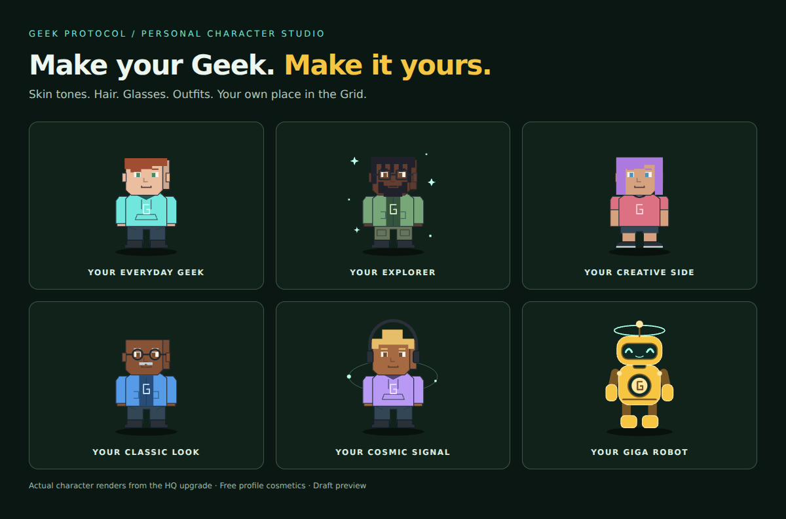
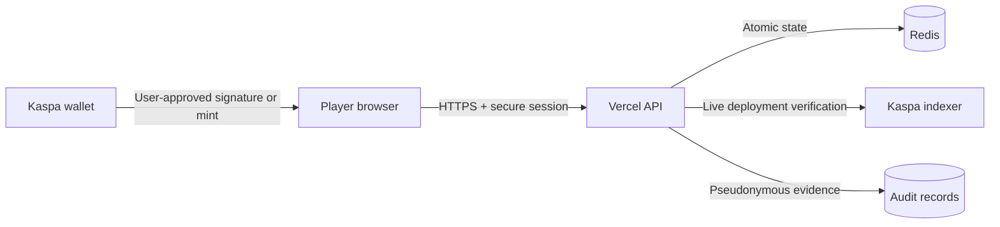
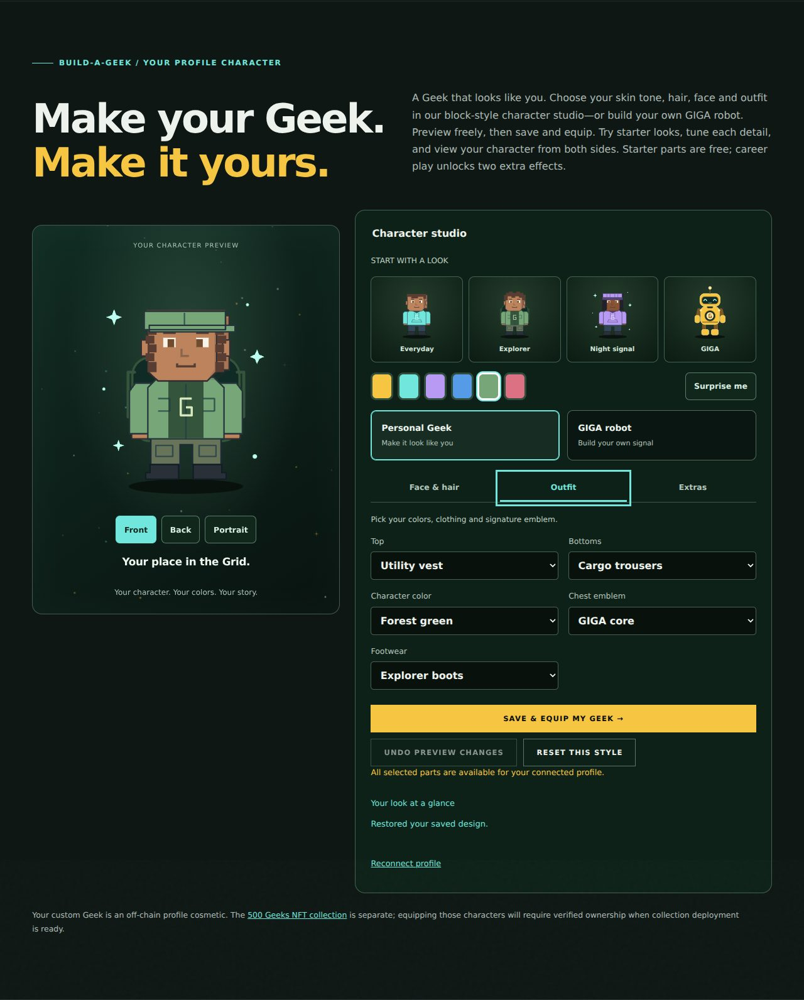

<div align="center">
  

  <br />

  [](https://github.com/GEEKProtocol0110/geek-protocol-hq/actions/workflows/security-verification.yml)
  [](https://www.geekprotocol.xyz/)
  [](LICENSE)
  [](docs/PROJECT-STATUS.md)

  **A server-authoritative learning and competition platform built for the Kaspa ecosystem.**

  [Live HQ](https://www.geekprotocol.xyz/) · [Play](https://www.geekprotocol.xyz/play/) · [Explore the Grid](https://www.geekprotocol.xyz/collection/) · [Security](https://www.geekprotocol.xyz/security/) · [Documentation](docs/README.md)
</div>

---

The [daily vault](https://www.geekprotocol.xyz/vault/) offers one visible cosmetic seal per UTC day, with a private collection and replay-safe receipts. Login claims award no XP, credits, or tokens.

**Current focus:** polish Learn → Study → practice → see progress. Existing extras remain available through Explore; economy accounting foundations are now active. Larger Arena, DAO and launchpad expansions remain on hold. Real purchases and settlement remain disabled.

The [power-up and economy foundation](https://www.geekprotocol.xyz/economy/) restores six planned items, treasury categories, exact 70/30 fee examples, and a private planning journal. It cannot move funds or create spendable GEEK. Try [free assisted practice](https://www.geekprotocol.xyz/practice/) with one 50/50 and one Extra Time use per session. It awards no XP, credits, tokens or ranked entries. Read the [Economy Protocol](docs/ECONOMY-PROTOCOL.md).

**Question bank:** 7,786 distinct active questions across eight categories after the October 8 editorial pass and ten sourced KRC-20 additions. See [Question Maintenance](docs/QUESTION-MAINTENANCE.md) for counts, source licenses, and editorial review status.

## What is Geek Protocol?

Geek Protocol turns knowledge into a verifiable player journey. Players study Kaspa at their own pace with A.C.E., revisit missed concepts, compete in timed trivia, build persistent profiles, join live lobbies, contribute reviewed questions, and interact with the GEEK ecosystem through non-custodial Kaspa wallet proofs and a Kasware mint flow.

The project began as a way to make learning exciting for one child. HQ is the public Alpha where that idea is becoming a transparent, security-first Proof-of-Learning platform on Kaspa.

> **All hope, no hype.** Public claims in this repository distinguish what is live, internally verified, independently audited, and still gated.

## Current status

| System | Status | Boundary |
| --- | --- | --- |
| Public website and information surfaces | **Live** | Production at `www.geekprotocol.xyz` |
| Ranked trivia, lobbies, leaderboards, and profiles | **Public Alpha** | Server-authoritative; Redis required |
| Kaspa identity and account recovery | **Implemented Alpha** | Server-verified KIP-5 proofs through browser wallets or pasted signatures; wallet signing support required |
| GEEK fair-mint interface | **Live / non-custodial** | One user-approved request against the pinned deployment |
| Community Content Engine | **Alpha** | Reviewed questions earn internal first-use credits |
| Alpha GEEK rewards | **Internal ledger only** | No withdrawals, transfers, or promised monetary value |
| 500-Geek collection | **Design and provenance phase** | Ownership and collection minting are disabled |
| Independent security audit | **Not completed** | Required before treasury-controlled value movement |

See the dated [Project Status](docs/PROJECT-STATUS.md) for the release-readiness matrix and open launch gates. The [Full Product Roadmap](docs/PRODUCT-ROADMAP.md) preserves Geek Arena, creator rewards, the proposed 70/30 platform-fee model, community governance, schools, professional development, and open infrastructure with explicit implementation stages.

## Product surfaces

| Surface | Purpose |
| --- | --- |
| **Learn / Study** | Kaspa 101 field guide plus eight guided lessons, three practice levels, and private saved concept feedback |
| **Play** | Ten-round Geek Gauntlet, server-owned Daily/Speed, and free unranked [Memory Grid](https://www.geekprotocol.xyz/memory/) |
| **[Free tools](https://www.geekprotocol.xyz/tools/)** | Geek Mini browser quizzes and supporter sharing, plus Kaspa Live Widget Android test-build installation help |
| **Daily vault** | One visible cosmetic seal per UTC day, private collection, and atomic claim receipts |
| **Challenges** | Shared Weekly Signal and Monthly Circuit with one attempt per UTC period and separate verified standings |
| **Lobbies** | Active seats, shareable rooms, and host-started ten-question shared practice rounds with server-scored standings |
| **Player dashboard** | Levels 1–50, 25 manual prestige ranks, achievements, challenges, verified standings, category records and collectibles |
| **C.C.E.** | Community question submission, moderation, publication, and first-use reward records |
| **Profile characters** | Free block-style Personal Geek and GIGA robot editor with server-saved skin, hair, face, outfit and accessory choices, plus five launch avatars |
| **Collection** | Five-tier, 500-NFT blueprint with planned mint/reward/GEEK-or-KAS purchase routes and hashed legacy-art archive |
| **Mint** | Fail-closed, user-approved GEEK KRC-20 fair-mint interface |
| **Operations** | Private owner workspaces for questions, audit activity, payout reviews and [holiday appearance](docs/HOLIDAY-THEMES.md) |
| **Security** | Public control posture, trust boundaries, and independent-audit gates |

## Hall of Thanks

[The Hall of Thanks](https://www.geekprotocol.xyz/thanks/) honors Kaspa, our community, the tools behind HQ and the sources behind its learning content. Its first dedication is preserved in the repository history. [Attribution and maintenance](docs/HALL-OF-THANKS.md).

## Personal Geek character studio

Make a block-style character with skin, hair, face and clothing choices, or keep a custom GIGA robot. Free profile designs save to the existing player account; NFT ownership remains separate.



## Architecture at a glance


```mermaid
flowchart LR
    P[Player browser] -->|HTTPS + secure session| A[Vercel API]
    W[Kaspa wallet] -->|User-approved signature or mint| P
    A -->|Atomic state| R[(Redis)]
    A -->|Live deployment verification| K[Kaspa indexer]
    A -->|Pseudonymous evidence| E[(Audit records)]
```

The browser renders the experience but does not own ranked answers, scores, rewards, moderation results, or payout eligibility. Sensitive state transitions are verified and committed by the server. Read the full [Architecture and Trust Boundaries](docs/ARCHITECTURE.md).

## Security posture

Geek Protocol is designed to fail closed around identity, mint verification, ranked play, and any future value movement.

- Ranked answer keys never enter the public bundle.
- Scores, XP, streaks, rewards, and deadlines are computed by the server.
- Shared lobby rounds use a fixed server clock and one atomic answer per player and question; their practice standings do not award Alpha GEEK or tokens.
- Wallet challenges are random, single-use, short-lived, and bound to the exact HTTPS origin and action.
- The server verifies Kaspa Schnorr signatures and public-key/address correspondence.
- Mint requests are pinned to Kaspa Mainnet and the canonical GEEK deployment.
- An unavailable indexer, deployment mismatch, or exhausted supply blocks mint initiation.
- Payout preferences cannot activate settlement; withdrawals remain disabled.

CI scans the configured public files for known private bank records and checks answer-disclosure and disabled-settlement API transitions against real Redis. See [Release boundary checks and their limits](docs/RELEASE-BOUNDARY-CHECKS.md).
- Security events are private, pseudonymous, and integrity verifiable.
- Every production change runs tests, deterministic manifest checks, and security-control verification.

This repository has **not** completed an independent audit. Read [SECURITY.md](SECURITY.md), the [Threat Model](docs/THREAT-MODEL.md), and the [Independent Audit Scope](docs/AUDIT-SCOPE.md) before making security claims or proposing value-moving code.

## Repository map

```text
api/          Vercel Function entry points
server/       Domain logic, identity, ranking, rewards, and controls
public/       Production pages, client assets, and public manifests
tests/        Integration, mint, collection, and archive tests
scripts/      Deterministic generators and security verification
security/     Machine-readable control and evidence map
docs/         Protocol, architecture, audit, and product documentation
.github/      CI, issue forms, and pull-request standards
```

## Local development

### Requirements

- Node.js 20 or newer
- npm
- An Upstash Redis database for persistent sessions and ranked features

### Setup

```sh
git clone https://github.com/GEEKProtocol0110/geek-protocol-hq.git
cd geek-protocol-hq
npm ci --ignore-scripts
cp .env.example .env.local
npm run verify
```

Vercel serves `public/` and discovers serverless functions in `api/`. Static information pages work without Redis; stateful and ranked surfaces fail closed when their required storage is unavailable.

### Required production configuration

| Variable | Purpose |
| --- | --- |
| `UPSTASH_REDIS_REST_URL` | Redis REST endpoint |
| `UPSTASH_REDIS_REST_TOKEN` | Redis REST credential |
| `CCE_ADMIN_TOKEN` | Dedicated question-moderation credential |
| `AUDIT_LOG_SECRET` | HMAC-SHA-256 audit-integrity key |
| `AUDIT_KEY_ID` | Non-secret audit key identifier |
| `AUDIT_ADMIN_TOKEN` | Private audit-export credential |
| `PAYOUT_REVIEW_ADMIN_TOKEN` | Separate payout-review credential |

The [operations dashboard](https://www.geekprotocol.xyz/ops/) brings community moderation, payout-setting risk reviews and read-only audit activity together. A single private owner sign-in opens separate Questions, Audit activity and Payout reviews pages. Permissions and role secrets are checked on the server. See [Operations](docs/OPERATIONS.md) for access and review procedures.

The annotated [.env.example](.env.example) documents optional settings and safe local placeholders. Never commit production credentials.

## Verification

Run the same complete quality gate used for reviewed changes:

```sh
npm run verify
```

The command validates functional tests, the deterministic 500-Geek manifest, all recovered-art hashes, security invariants, and control evidence. CI also checks JavaScript syntax and audits production dependencies at `high` severity.

## Documentation

Start with the [Documentation Index](docs/README.md). Key reviewer material includes:

- [Architecture and Trust Boundaries](docs/ARCHITECTURE.md)
- [Project Status](docs/PROJECT-STATUS.md)
- [Independent Audit Scope](docs/AUDIT-SCOPE.md)
- [Threat Model](docs/THREAT-MODEL.md)
- [Identity Protocol](docs/IDENTITY-PROTOCOL.md)
- [Mint Protocol](docs/MINT-PROTOCOL.md)
- [Payout Risk Controls](docs/PAYOUT-RISK-CONTROLS.md)
- [Collectible Protocol](docs/COLLECTIBLE-PROTOCOL.md)
- [500-Geek Art Bible](docs/GEEK-500-ART-BIBLE.md)

## Contributing

Read [CONTRIBUTING.md](CONTRIBUTING.md) before opening a pull request. Every change must preserve the project's public Alpha boundaries, pass `npm run verify`, and avoid claims that exceed the available evidence.

Do not report unpatched vulnerabilities in a public issue. Follow [SECURITY.md](SECURITY.md) and use GitHub private vulnerability reporting.

## License

Code in this repository is available under the [MIT License](LICENSE). Geek Protocol names, logos, character artwork, lore, and other brand assets are not granted for reuse by that software license unless separately stated.

---

<div align="center">
  <strong>Level Up. Earn On. Geek Out.™</strong><br />
  Built on Kaspa · Your knowledge is now an asset.
</div>

### Free Geek Duel

Invite a friend or challenge a simulated A.C.E. opponent at [Geek Duel](https://www.geekprotocol.xyz/duel/): friend players ready up together, or start solo with Cadet/Operator/Vanguard difficulty; answer ten shared questions with a server clock, see a final result and agree to a rematch. Saved personal Geeks appear beside room scores. This free Alpha format grants no XP or monetary rewards. [Rules and architecture](docs/DUEL-PROTOCOL.md).

### Quiz Quest: solo campaign

[Quiz Quest](https://www.geekprotocol.xyz/quest/) has three free solo chapters: First Signal explores Kaspa’s origins; Inside the blockDAG teaches parent links, parallel blocks and consensus ordering; Keys to the Grid adds wallet-safety decisions. Complete each earlier chapter to unlock the next, then resume from the campaign map. Explore with your selected Geek and GIGA, read A.C.E.’s learning notes, and save progress through six untimed checks per chapter. Each chapter has its own completion badge, saved place and dashboard card. Missed answers remain available for review; replaying preserves the original badge. No ranked XP or token rewards are awarded. [Chapter protocol](docs/QUEST-PROTOCOL.md).

### Player HQ and character studio

Your next chapter, career unlock and achievement goal now share a dashboard entrance. The career roadmap links levels, titles, avatars and earned effects. The upgraded My Geek studio offers starter looks, swatches, extra hair/clothing, front/back views, a portrait crop and explicit Save & equip. Explorer pulse opens at level 5; Prestige crown opens at Prestige 1. Earned effects remain available after a reset.



[Release scope and verification](docs/PLAYER-HQ-UPGRADE.md) · [Player dashboard](https://www.geekprotocol.xyz/profile/)

### Trivia Royale — free multiplayer Alpha

[Trivia Royale](https://www.geekprotocol.xyz/royale/) implements The Battle of a Hundred Minds: choose a player limit from 2 to 100, invite the crew and start when at least two players are online and ready. The room does not need to be full. Wrong, missing and slowest correct answers eliminate players; exact ties stay together. A shared 15-second question clock, five-second reveal and stable-identity reconnect lead to the Last Mind Standing's visual room-result medal. No XP or monetary rewards. The implementation has local real-Redis 100-client tests; deployment and a real production pilot are pending. [Rules and architecture](docs/ROYALE-PROTOCOL.md).
