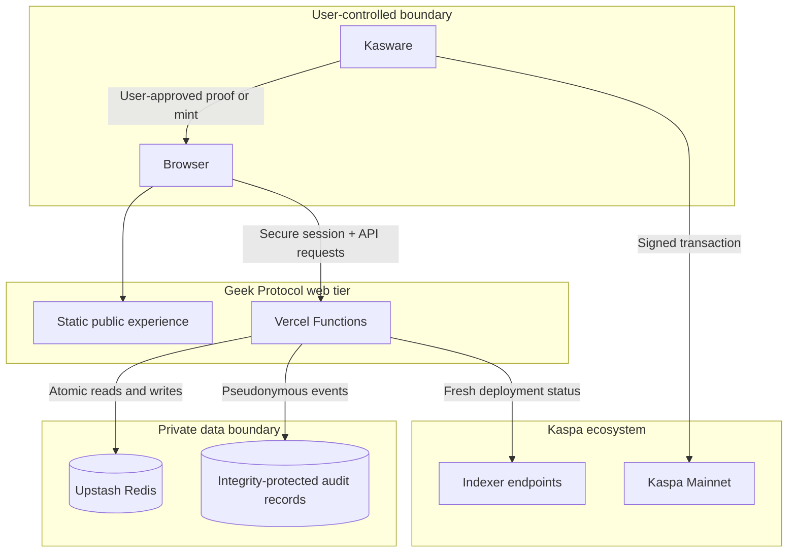

# Architecture and Trust Boundaries

## System context

Geek Protocol HQ is a static-first web application with Vercel Functions for trusted state transitions. Upstash Redis stores short-lived authorization state and durable Alpha records. Kasware remains the user's signing boundary; the application never requests private keys or seed phrases.

## Component responsibilities

| Component | Trusted responsibility | Explicitly not trusted for |
| --- | --- | --- |
| Browser | Rendering, user input, wallet request initiation | Correct answers, scores, balances, moderation, payout eligibility |
| Kasware | User approval, signatures, transaction submission | Geek Protocol game or reward state |
| Vercel Functions | Authorization, validation, scoring, state transitions | Custody of wallet keys |
| Redis | Session, game, identity, lobby, contribution, and Alpha ledger state | Independent settlement accounting |
| Kaspa indexer | Current public token deployment state | Player identity or application authorization |
| Audit records | Reviewable evidence for sensitive Alpha actions | Full production SIEM or immutable third-party replication |

## Primary flows

### Ranked answer

1. The server selects a question and cryptographically shuffles answer options.
2. The browser receives display data, an opaque single-use token, and a deadline—not the answer key.
3. The player submits one answer.
4. The server atomically claims the token, validates time and choice, and commits the result.
5. The server derives score, streak, XP, and any eligible Alpha credit.

### Wallet identity proof

1. The server issues a random five-minute challenge bound to the exact HTTPS origin, player, wallet, and action.
2. Kasware signs human-readable challenge text in explicit Schnorr mode.
3. The server verifies the signature and derives the Kaspa Mainnet address from the public key.
4. The challenge is consumed once and the binding transition commits atomically.
5. Recovery increments the identity session version so older sessions fail closed.

### GEEK fair mint

1. The server obtains fresh deployment data and verifies the ticker, supply, limit, and reveal hash.
2. Any unavailable, mismatched, substituted, or exhausted state blocks the request.
3. The browser asks Kasware to create one fixed mint request on Kaspa Mainnet.
4. The user approves or rejects inside Kasware.
5. HQ never signs, submits, or stores the raw transaction.

## Data classification

| Class | Examples | Handling |
| --- | --- | --- |
| Public | Pages, leaderboard aliases, collection manifests | Publicly served and cacheable where safe |
| Pseudonymous | Player IDs in audit evidence, masked destinations | Minimized and kept behind authenticated or privileged APIs |
| Sensitive application state | Sessions, challenges, moderation, payout review | Server-only storage with bounded authorization |
| Secrets | Redis, moderator, audit, and review credentials | Deployment configuration only; never public or committed |
| Wallet secrets | Seed phrases and private keys | Never requested, transmitted, or stored by HQ |

## Deployment boundary

Production serves static assets from `public/` and JavaScript functions from `api/`. Domain logic lives in `server/`, and security controls map required evidence across code, tests, documentation, and deployment configuration.

The web tier is not a treasury. Any future signer, payout worker, reconciliation service, or contract belongs in a separately isolated and independently audited boundary before it can move value.
