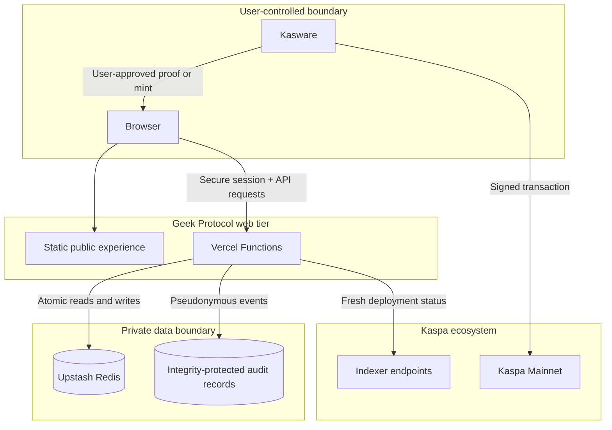

# Architecture and Trust Boundaries

## System context

Geek Protocol HQ is a static-first web application with Vercel Functions for trusted state transitions. Upstash Redis stores short-lived authorization state and durable Alpha records. Kasware remains the user's signing boundary; the application never requests private keys or seed phrases.

```mermaid
flowchart TB
    subgraph User[User-controlled boundary]
        B[Browser]
        W[Kasware]
    end

    subgraph Edge[Geek Protocol web tier]
        S[Static public experience]
        A[Vercel Functions]
    end

    subgraph Data[Private data boundary]
        R[(Upstash Redis)]
        L[(Integrity-protected audit records)]
    end

    subgraph Kaspa[Kaspa ecosystem]
        I[Indexer endpoints]
        N[Kaspa Mainnet]
    end

    B --> S
    B -->|Secure session + API requests| A
    W -->|User-approved proof or mint| B
    A -->|Atomic reads and writes| R
    A -->|Pseudonymous events| L
    A -->|Fresh deployment status| I
    W -->|Signed transaction| N
```

## Component responsibilities

| Component | Trusted responsibility | Explicitly not trusted for |
| --- | --- | --- |
| Browser | Rendering, user input, wallet request initiation | Correct answers, scores, balances, moderation, payout eligibility |
| Kasware | User approval, signatures, transaction submission | Geek Protocol game or reward state |
| Vercel Functions | Authorization, validation, scoring, state transitions | Custody of wallet keys |
| Redis | Session, game, identity, lobby, contribution, and Alpha ledger state | Independent settlement accounting |
| Kaspa indexer | Current public token deployment state | Player identity or application authorization |
| Audit records | Reviewable evidence for sensitive Alpha actions | Full production SIEM or immutable third-party replication |

## Daily vault

`/api/session/?service=vault` serves private status and explicit claims. A Lua transition checks Redis time against the server-selected UTC day, returns the original receipt on retries, and updates both the seven-design cosmetic collection and its latest 14 receipts in one `geek:vault:<player>` record. Eligibility does not expire or depend on browser storage. The vault does not write existing profiles, stickers, XP, balances, Study progress, or leaderboards.

## Primary flows

### Shared lobby practice round

1. The host starts a room only after at least two seats are active. The server fixes the participant roster, selects ten questions and options, and schedules one shared 15-second window per question.
2. Each participant fetches the current question from the server. The response contains no answer key or private match state.
3. An atomic Redis script checks the room roster, shared deadline, and previous answer, then records exactly one answer and updates the server-computed practice score.
4. All participants see the same questions and room standings. Lobby scores do not alter ranked Gauntlet scores, XP, Alpha GEEK, or on-chain balances.

### Untimed Study

1. Public catalog metadata contains eight guided lessons, objectives, worked examples/reflections, practice levels, and sources, without question pools or answer keys. The Study handler shares `/api/ranked/?service=study` to remain within the existing function budget.
2. A valid browser session starts up to five distinct concepts within its selected level in the private `geek:study:` Redis namespace. Questions have no answer deadline. State expires after 24 hours without a saved transition; unfinished runs retain their selected IDs and grading.
3. Only the owning session can answer, resume, or advance. One Redis script commits the answer and updates private player-keyed concept feedback atomically, then reveals the explanation and source. Retried answers and next requests return the recorded transition without extra progress.
4. A completed session can retry exactly its missed concepts. A separate review draws up to five concepts whose latest recorded answer was incorrect, independent of run expiry. Progress uses `geek:study-progress:` hashes, at most 80 canonical records per player, and a 180-day TTL refreshed by answers. Study never writes ranked runs, leaderboards, XP, credits, contribution rewards, or collectible inventory.
5. A.C.E. renders authored lessons and answer guidance. It is not an unrestricted chat service or an independent content reviewer.

### Weekly and monthly challenges

The existing ranked function routes `service=challenges` to the isolated periodic handler. Versioned deterministic selection freezes a private question snapshot per UTC period; each attempt pins that snapshot’s hash. One Lua claim checks capacity and creates one attempt per resolved player. Answer/next/finish transitions compare the full stored state and enforce deadlines. Completion writes state, score and public metadata together. Boards have tie-aware ranks, top-ten public listings and private own-rank results. Period data expires 60 days after close. No profile, Study, ordinary leaderboard or economy writes occur. See [Challenge Protocol](CHALLENGE-PROTOCOL.md).

### Ranked answer

1. The server selects a question and cryptographically shuffles answer options.
2. The browser receives display data, an opaque single-use token, and a deadline—not the answer key.
3. The player submits one answer.
4. The server atomically claims the token, validates time and choice, and commits the result.
5. The server derives score, streak, XP, and any eligible Alpha credit.

### Wallet identity proof

1. The server issues a random five-minute challenge bound to the exact HTTPS origin, player, wallet, and action.
2. Kasware signs human-readable challenge text in explicit Schnorr mode.
3. The server verifies the signature and derives the Kaspa Mainnet address from the public key.
4. The challenge is consumed once and the binding transition commits atomically.
5. Recovery increments the identity session version so older sessions fail closed.

### GEEK fair mint

1. The server obtains fresh deployment data and verifies the ticker, supply, limit, and reveal hash.
2. Any unavailable, mismatched, substituted, or exhausted state blocks the request.
3. The browser asks Kasware to create one fixed mint request on Kaspa Mainnet.
4. The user approves or rejects inside Kasware.
5. HQ never signs, submits, or stores the raw transaction.

## Data classification

| Class | Examples | Handling |
| --- | --- | --- |
| Public | Pages, leaderboard aliases, collection manifests | Publicly served and cacheable where safe |
| Pseudonymous | Player IDs in audit evidence, masked destinations | Minimized and kept behind authenticated or privileged APIs |
| Sensitive application state | Sessions, challenges, moderation, payout review | Server-only storage with bounded authorization |
| Secrets | Redis, moderator, audit, and review credentials | Deployment configuration only; never public or committed |
| Wallet secrets | Seed phrases and private keys | Never requested, transmitted, or stored by HQ |

## Deployment boundary

Production serves static assets from `public/` and JavaScript functions from `api/`. Domain logic lives in `server/`, and security controls map required evidence across code, tests, documentation, and deployment configuration.

The web tier is not a treasury. Any future signer, payout worker, reconciliation service, or contract belongs in a separately isolated and independently audited boundary before it can move value.

### Economy planning foundation

The existing session function routes `service=economy` to a public status/catalog read and a session-bound private journal read. The shared amount module uses pinned eight-decimal integer strings and BigInt fee splits. Trusted internal planning receipts use one-key Redis CAS, stable-reference idempotency, a bounded receipt chain and recomputed cumulative totals. No client write, payment acceptance, profile credit, inventory effect, token transfer or burn confirmation is exposed. A reserve-address configuration is format status only. See [Economy Protocol](ECONOMY-PROTOCOL.md) for current evidence and monetary launch work.

## Assisted practice

`/practice/` uses the existing ranked function router (`service=practice`) for a separate free, unranked ten-question Kaspa session. The private bank supplies questions and answer keys. A server-held one-use allowance for 50/50 and Extra Time is scoped to each session. One-key Redis compare-and-set serializes answers, lifelines and Next actions. Answer tokens and used flags make retries idempotent; expired questions cannot be extended. Explanations have no clock. Runs are isolated by resolved player ID and expire after two hours; they never update profile XP, Alpha credits, leaderboards, paid inventory or the economy journal. The UI can resume its session-tab run ID; storage failures leave new practice usable.

## Traffic analytics

The founder enabled Vercel Web Analytics on October 3, 2026. Public pages load `public/assets/analytics.js`, which queues Vercel's documented HTML `beforeSend` hook before loading the same-origin `/_vercel/insights/script.js`. Production page views are deployed. Tracking runs only on the two official production hostnames and the explicit public-page list. Page-view and event URLs are normalized without query strings or fragments. Moderation and unlisted paths, local/preview hosts, Do Not Track, and Global Privacy Control are excluded. Browser blockers or an unavailable analytics endpoint must not prevent learning. Dashboard reporting and quotas are managed by the founder's Vercel account; enabling analytics does not recreate earlier traffic history.

### Learning activity events

`window.GeekAnalytics.track(name, data)` accepts only the following events, routes, and fixed category values. The `beforeSend` hook independently enforces the same allowlist and rebuilds payloads, discarding extra properties. No answers, scores, question tokens, run/player IDs, wallet addresses, names, free text, or form contents are sent. Run IDs are used only in page memory to suppress duplicate confirmations; analytics adds no browser storage or cookies.

| Event | Trigger | Allowed data |
| --- | --- | --- |
| Lesson walkthrough completed | On Study, Next idea reaches the final example, once per selected walkthrough | One of the eight curriculum `topic` IDs |
| Practice started | Successful start response for a new Study or assisted practice run | `mode`: study/assisted; Study also supplies curriculum `topic` and `level` |
| Practice completed | Successful answer response includes the finished Study summary or assisted practice state | Same fixed categories as Practice started |
| Free lifeline used | Successful assisted practice lifeline response confirms the item is used | `item`: fifty-fifty/extra-time |
| Giga choice selected | A visitor changes Giga's selected next-step choice on Home, Study, or Progress | `surface`: home/study-welcome/progress; `choice`: start/understand/practice/review |
| Memory Grid started / Memory Grid completed | A new board is created / the last pair is matched on Memory Grid | `pairs`: 4/6/8 only |

Completion and lifeline events run after successful API confirmation, outside rendering. Repeated confirmations are suppressed within the page. Viewing, resuming, or reloading an existing summary or used lifeline does not create a new event; selecting the already selected Giga choice does not count again. A walkthrough event records reaching the example, not time spent reading or demonstrated understanding. These are approximate client activity counts, not reward evidence, unique learner counts, or a complete audit trail. Blocking, privacy preferences, failed/lost responses, reloads, and automated traffic can affect totals. No custom collector, payout changes, or learning-progress writes are introduced.

Vercel custom-event reports require a **Pro or Enterprise** plan ([official documentation](https://vercel.com/docs/analytics/custom-events)). The founder's account plan has not been verified, and this integration does not change the plan or billing. On a qualifying plan, open the project **Analytics → Production** dashboard and its custom events section. Event instrumentation is ready on other plans, but reporting availability must not be assumed; page-view analytics continues independently.

## Memory Grid boundary

`public/memory/` is a free, unranked browser game. Its separate public teaching deck contains eight Kaspa term/meaning pairs with explanations and primary-source links. A shuffled board has four, six or eight pairs. The pure model refuses duplicate/unknown flips, freezes further flips during a mismatch, and reaches completion after each card belongs to one matched pair. Mismatches remain visible until the player closes them; no timer is used. Restarting replaces all board state. The UI uses native buttons, visible focus, accessible card labels/status, explicit mismatch controls and reduced-motion support.

Board state, selections, matches and attempt counts exist only in page memory. There are no backend requests, storage writes, account/progression changes, XP, credits, rankings or monetary actions. Public pair identities are not secrets; inspecting the client cannot create a ranked result or reward. Existing private quiz banks and server game handlers are unchanged. Optional production analytics supplies only board-size categories for start/completion, never card IDs, selected terms, matches, attempts, or scores. Giga encouragement is authored text, not adaptive AI or a validated learning assessment.

## Profile character and NFT collection (October 3, 2026)

The founder specifies 500 NFTs in five tiers: Common 250, Rare 125, Epic 75, Legendary 48 and Mythic 2. Collection schema 1.1 folds the prior eight Elite identities into Legendary, retaining IDs, names, lore and GIGA/A.C.E. anchors. Planned public mint, earned reward, and GEEK/KAS purchase routes share this one capped supply. Allocations and prices are unset and all routes remain disabled. Verified ownership is required before NFT equipping; profile cosmetics cannot alter frozen NFT metadata.

Build-a-GEEK is a free off-chain profile character editor with fixed color, headgear, face, torso, arms, legs, back and effect options. Previewing causes no write. Explicit Save & equip uses the session-authenticated, rate-limited collectibles endpoint, rejects arbitrary traits, stores the customization and equips `giga-builder`. Atomic Redis field patches preserve concurrent profile fields, with audit records. Existing five launch avatar unlocks remain server-controlled. Switching avatars retains the saved custom design. Reloading retrieves it from the same profile. Session loss follows the existing profile recovery rules. No profile traits are sent to analytics. This release does not mint NFTs, create token rewards, accept payments or require sensitive configuration.
