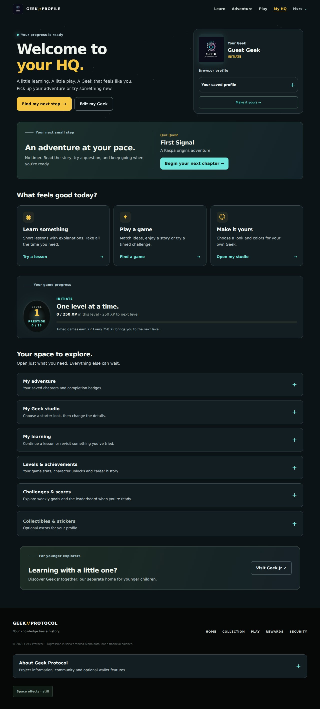
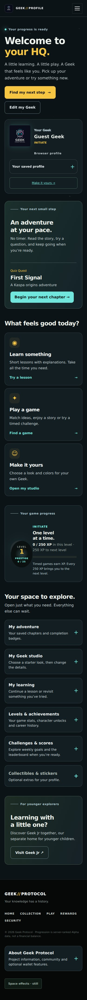

# HQ interface polish

This change makes Geek Protocol HQ easier to approach for younger learners while preserving the existing game and learning services. Geek Jr remains a separate site; the home page, HQ and navigation now make the family destination easier to find.

## What changes

- Four consistent main destinations: Learn, Adventure, Play and My HQ. The field guide and extra games are under More. Project and optional wallet features remain reachable from the footer.
- Home has one primary adventure action, three clear paths and a visible Geek Jr invitation. Project history and launch detail open on request.
- HQ starts with the saved next chapter, three familiar choices and compact game progress. Adventure, studio, learning records, levels, achievements, challenges and collectibles use native expandable sections.
- Deep links open the right section and focus their destination, including nested records. Reloading a studio or achievement link keeps that destination accessible. Sections also open with the keyboard and without JavaScript.
- Games lead with Quest, Memory Grid and solo Duel. Timed controls and standings are grouped separately; existing mode/category links open timed controls automatically.
- Study instructions, campaign overview and Duel invitation/scoring instructions are available when needed. Headings, cards, spacing, labels and phone controls share a calmer gold-and-teal presentation.

XP, scoring, timers, chapter prerequisites, character ownership and save authorization are unchanged. Study and Quest retain their separate progress systems.

## Internal verification

- `npm run verify`: 138 tests passed, including real Redis coverage; collection, archive, security evidence (236 assertions) and repository checks passed.
- Browser checks used the actual local API handlers with isolated Redis and synthetic profiles. No production accounts or transactions were used.
- Home, HQ, Play, Study, Quest, Duel and Memory rendered at 320, 375, 768 and 1280 pixels without horizontal document overflow.
- Checked default closed records, clicked and direct deep links, reload, keyboard opening, mobile menu/Escape and footer project links.
- Checked character presets, locked effects, explicit save/reload, keyboard tabs and phone editing; actual optional prestige and preserved unlocks; all three chapters completed with sequential unlocking; A.C.E. ready/answer/reload/results/rematch/leave; career service failure.
- Checked timed Daily start, five answers, answer review, final result save and responsive result/completion screens. No browser JavaScript errors were observed.

## Review screenshots

These show a synthetic guest profile with reduced motion enabled.

## Try the navigation

1. Open `/profile/`: the records start closed. Choose **Edit my Geek**, adjust a look and save it.
2. Open `/profile/#achievement-title` directly: the career section opens and the heading receives focus.
3. At phone width, open and close the menu, then open the studio with the keyboard or touch.
4. Open `/play/`: untimed paths are visible first. Open `/play/?mode=daily` to see the timed controls immediately.
5. Open **More → About the project** to reach the optional project links, or **Visit Geek Jr** for the separate family site.
