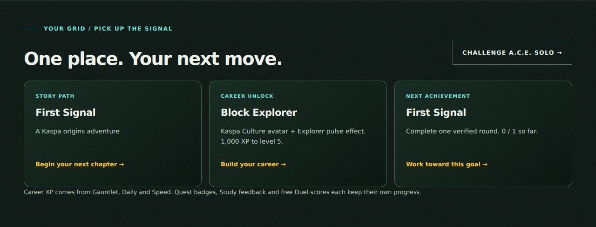
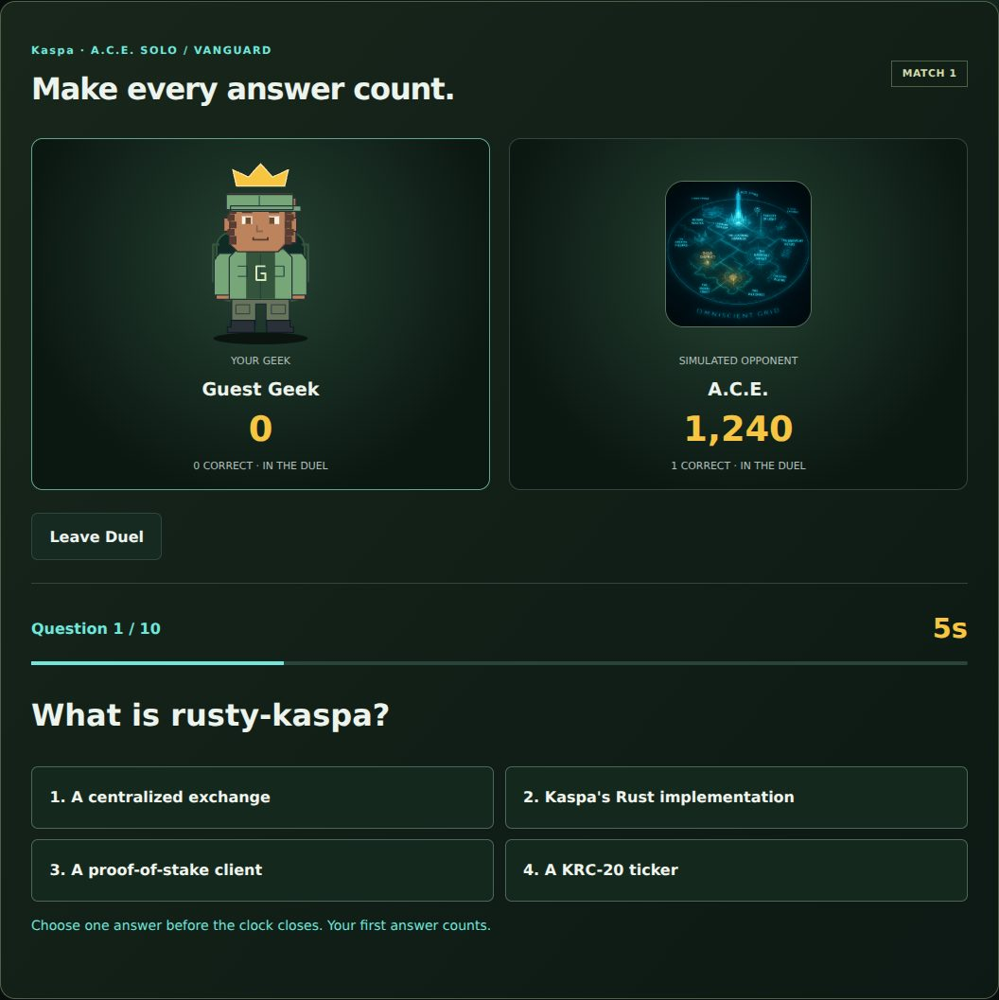
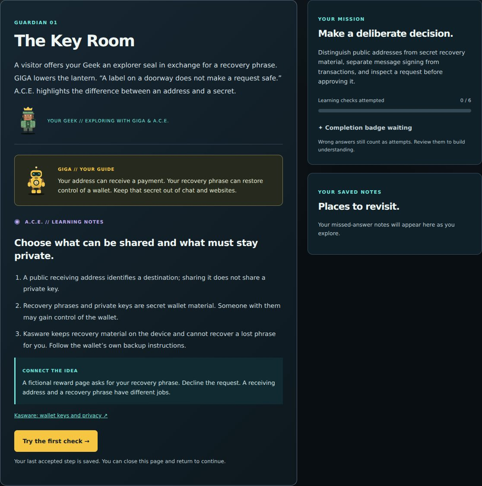

# Player HQ — October 6, 2026

The release connects player identity and existing progression, adds a solo opponent, and extends the saved story campaign. It is a free Alpha upgrade built on the current session, career, collection, Duel and Quest protocols.

## Delivered behavior

| Area | Player experience | Source of saved authority |
| --- | --- | --- |
| My Geek | Four starter looks, swatches, randomization, extra hair/clothing/headgear, front/back views, portrait crop, Undo, explicit Save & equip | Fixed cosmetic schema v2 and existing CAS field patch with audit records |
| Dashboard | Larger selected Geek, next chapter, next career unlock and closest unfinished game achievement (then career goals), with direct activity links | Independent authenticated profile and campaign responses |
| Progression | Six career milestones, achievement bars/filters, two earned effects retained through prestige | Existing XP and prestige ledger; no new reward counter |
| Solo Duel | A.C.E. simulation with Cadet, Operator and Vanguard presets, ten timed questions, room scores, resume and rematch | Private server-generated plans settled once by the existing Redis-clock Lua |
| Quiz Quest | Keys to the Grid: three Guardian scenes, six wallet-safety decisions, saved notes and Grid Guardian badge | Independent chapter record and full earlier-chapter completion chain |
| Mobile | Touch controls, shared navigation improvements, scrollable dashboard sections, compact studio/room/cards, bounded dialogs and accessible action rows | Presentation only; existing mutation guards remain authoritative |

A.C.E. is explicitly labeled a simulated opponent with preset response speed and correctness probability. It is not an adaptive AI service or an online person. Chapter 3 presents authored scenarios and decision feedback; story progression is shared rather than branching. Its notes cite primary wallet, integration and message-signing sources. No real wallet is needed for the chapter.

## Career goals

| Stage | Visible milestone/unlock | Retained after prestige |
| --- | --- | --- |
| Level 5 (1,000 cycle XP) | Block Explorer title, Kaspa Culture avatar, Explorer pulse effect | Yes |
| Level 10 (2,250 cycle XP) | DAG Pathfinder title, Quiz Quest avatar | Yes for avatar; current title follows the career rank |
| Level 20 (4,750 cycle XP) | Signal Master title | Current title follows the career rank |
| Level 30 (7,250 cycle XP) | Grid Navigator title | Current title follows the career rank |
| Level 50 (12,250 cycle XP) | Signal Commander, optional prestige eligibility | Earned milestone remains; eligibility follows the current cycle |
| Prestige 1 | Prestige Operator, Omniscient Grid avatar, Prestige crown effect | Yes |

The dashboard reports earned milestones across cycles. Current titles still come from the existing rank function. Prestige remains optional and does not improve scoring. Effect saves are authorized from the server's career ledger; changing browser progress, a body field or a preview cannot unlock them.

## Compatibility and limits

- Existing personal/robot v1/v2 saves, avatar IDs, XP thresholds, 25 prestige ranks and history remain compatible. The renderer uses authored SVG, with no uploads or arbitrary markup.
- Human Duel rooms preserve mutual readiness/rematches. Solo rooms reserve the simulated seat and reject outsiders. Scheduled answers stay private and score identically regardless of polling frequency.
- Chapter 1 and Chapter 2 saves retain their keys, versions and receipts. Chapter 3 checks both ancestors, including an old Chapter 2 receipt without Chapter 1. Replay never removes a saved completion receipt.
- Career XP still comes from Gauntlet, Daily and Speed. Weekly/monthly standings, Study feedback, Duel points and Quest badges remain separate. No automatic XP, token grants or NFT ownership comes from the new UI.
- Monetary, purchased-item, NFT mint, treasury and settlement gates are unchanged. No new dependency, function, secret or custom analytics event is added.

## Verification

- `npm run verify`: 138 tests passed, zero failures/skips, including production Lua against disposable real Redis. Collection/archive and repository checks passed.
- Source tests cover simulated-seat privacy, difficulty validation, scheduled scoring/catch-up, duplicate reads and answers, final result, rematch/stale IDs, disconnect/forfeit, cosmetic authority and retention after an actual prestige action, career thresholds, authored views, full chapter prerequisites, saved decision review and identity recovery.
- Browser QA uses actual API handlers, isolated synthetic profiles and disposable Redis: career-outage isolation and mobile menu/Escape, preset/edit/save/reload/undo, keyboard tabs, locked-effect preview, optional prestige, all three chapters completed with mistakes, map/dashboard badges, solo difficulty/ready/answer/reload/result/rematch/leave, and 320/375/768/1280px layouts. No browser JavaScript errors.
- Production dependency audit: zero vulnerabilities. JavaScript syntax and whitespace checks passed. Security controls GP-INV-027/028 are updated; GP-INV-029 documents earned cosmetic authority.

## Preview evidence

Synthetic local test profiles appear in these images.

